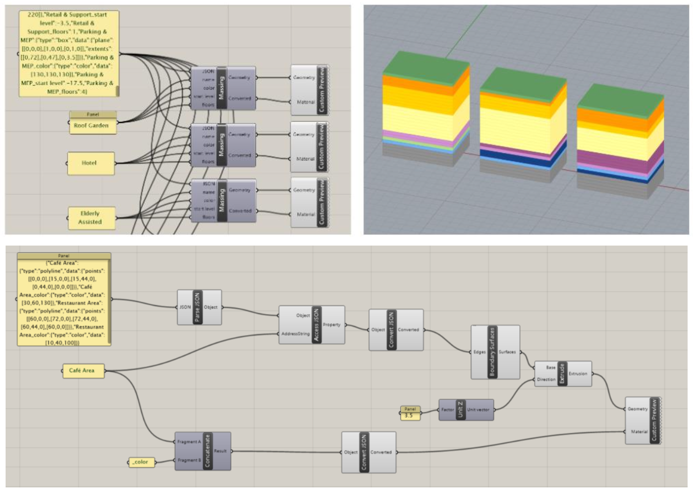
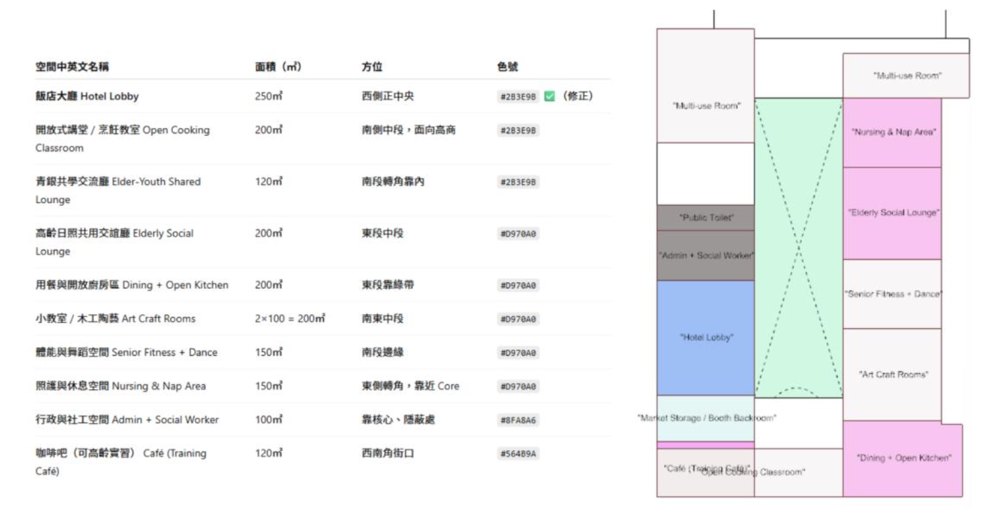

## 工具簡介
**(一) 名稱**：AI Reconfiguration Tool

其中又可以依照劃分依據分成三種測試
- test.1- Orientation-based Strip zoning
- test.2- Grid Fit Zoning
- test.3- Semantic Relationship + Spatial Type 3D Zoning

**(二) 用途/目的**：2D 空間配置 / 3D 量體配置

**(三) 使用者**：建築設計者

**(四) 使用範例**

進到 grasshopper 透過 Access Json 把 Json file 轉換為 Geometry 的範例

ChatGPT 產出的配置範例，以及轉換成 Grasshopper 後的初步配置範例。

