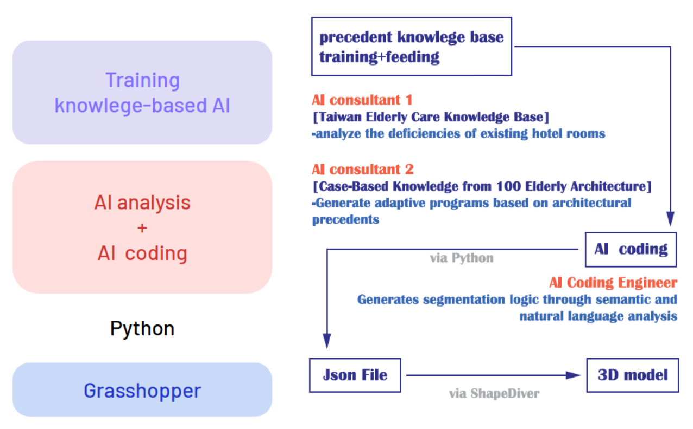

# AI in Architecture: Building a Case-Based Knowledge System and Applying it in Design Practice
賴芸蓁 Yun-Jhen Lai / 113-2 建築設計（七）

## Project Overview

## Project Workflow
### Part 1. Establishing the AI Consultant
#### Step 1 — Build the AI knowledge base
Including architectural precedent data, domain-specific
knowledge, and design guidelines
#### Step 2 — Write prompts to instruct the AI
Detailing the reasoning process step-by-step
#### Step 3 — Define the expected output format
Specify output format and purpose
### Part 2. Building the AI Co-designer
#### Step 1 — Set up all required AI consultants
For this project, the following consultants were created:
* AI Consultant 1: Taiwan Elderly Care Knowledge Base
* AI Consultant 2: Case-Based Knowledge from 100 Elderly Architecture Projects
#### Step 2 — Create an AI Coding Engineer
At first, I used the LLM to generate layout
data directly, but frequent errors led to the
creation of an AI Coding Engineer to handle
logic and constraints via Python scripts.
#### Step 3 — Run Python
To output configuration data (saved as .json)
#### Step 4 — Import into Grasshopper
Using ShapeDiver’s Access JSON component
(along with several others), the data is
converted into geometric representations.
#### Step 4 — Bake into Rhino
Final adjustments and refinements are made
manually in 3D.
